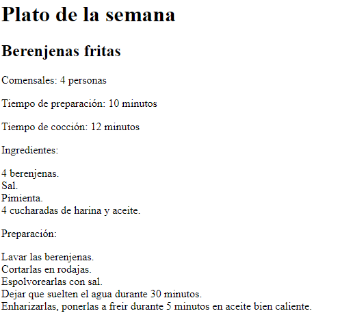

# TRABAJO REACT.JS 
## EJERCICIO # 1
## Código JavaScript

### Importo las librerías de React
```javascript
<script src="https://unpkg.com/react@16/umd/react.development.js"></script>
<script src="https://unpkg.com/react-dom@16/umd/react-dom.development.js"></script>
<script src="https://unpkg.com/babel-standalone@6/babel.min.js"></script>
```
### Creación de la variable "data", para guardar los datos del primer ejercicio
```javascript
const data = {
  titulo: "Plato de la semana",
  subtitle1:  "Berenjenas fritas",
  parrafo1: "Comensales: 4 personas",
  parrafo2: "Tiempo de preparación: 10 minutos",
  parrafo3: "Tiempo de cocción: 12 minutos",
  parrafo4: "Ingredientes:",
  ingrediente1:  "4 berenjenas.",
  ingrediente2:  "Sal.",
  ingrediente3:  "Pimienta.",
  ingrediente4:  "4 cucharadas de harina y aceite.",
  parrafo5:  "Preparación:",
  preparacion1:  "Lavar las berenjenas.",
  preparacion2:  "Cortarlas en rodajas.",
  preparacion3:  "Espolvorearlas con sal.",
  preparacion4:  "Dejar que suelten el agua durante 30 minutos.",
  preparacion5:  "Enharizarlas, ponerlas a freir durante 5 minutos en aceite bien caliente.",
}
```
### Creación de la variable element para imprimir los datos con formato JSX 
```javascript
const element = (
  <div>
    <h1>{data.titulo}</h1>
    <h2>{data.subtitle1}</h2>
    <p>{data.parrafo1}</p>
    <p>{data.parrafo2}</p>
    <p>{data.parrafo3}</p>
    <p>{data.parrafo4}</p>
    <p>
      {data.ingrediente1}<br/>
      {data.ingrediente2}<br/>
      {data.ingrediente3}<br/>
      {data.ingrediente4}
    </p>
    <p>{data.parrafo5}</p>
    <p>
      {data.preparacion1}<br/>
      {data.preparacion2}<br/>
      {data.preparacion3}<br/>
      {data.preparacion4}<br/>
      {data.preparacion5}
    </p>
    
  </div>
);
```
### Por último se pinta el documento JSX
```javascript
ReactDOM.render(
  element,// estructura jsx para pintar
  document.getElementById('root')// elemento donde se pintara
);
```

### Salida del ejercicio 1:
