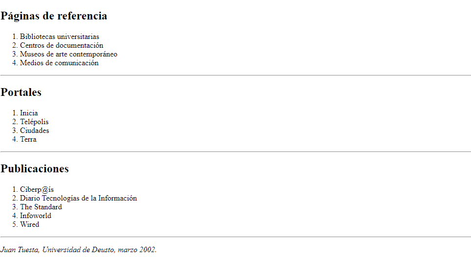

# TRABAJO JSX 
## EJERCICIO # 1
## Código JavaScript

### Importo las librerías de React
```javascript
<script src="https://unpkg.com/react@16/umd/react.development.js"></script>
<script src="https://unpkg.com/react-dom@16/umd/react-dom.development.js"></script>
<script src="https://unpkg.com/babel-standalone@6/babel.min.js"></script>
```
### Creación de la variable "data", para guardar los datos del primer ejercicio
```javascript
const data = {
  titulo: "Plato de la semana",
  subtitle1:  "Berenjenas fritas",
  parrafo1: "Comensales: 4 personas",
  parrafo2: "Tiempo de preparación: 10 minutos",
  parrafo3: "Tiempo de cocción: 12 minutos",
  parrafo4: "Ingredientes:",
  ingrediente1:  "4 berenjenas.",
  ingrediente2:  "Sal.",
  ingrediente3:  "Pimienta.",
  ingrediente4:  "4 cucharadas de harina y aceite.",
  parrafo5:  "Preparación:",
  preparacion1:  "Lavar las berenjenas.",
  preparacion2:  "Cortarlas en rodajas.",
  preparacion3:  "Espolvorearlas con sal.",
  preparacion4:  "Dejar que suelten el agua durante 30 minutos.",
  preparacion5:  "Enharizarlas, ponerlas a freir durante 5 minutos en aceite bien caliente.",
}
```
### Creación de la variable element para imprimir los datos con formato JSX 
```javascript
const element = (
  <div>
    <h1>{data.titulo}</h1>
    <h2>{data.subtitle1}</h2>
    <p>{data.parrafo1}</p>
    <p>{data.parrafo2}</p>
    <p>{data.parrafo3}</p>
    <p>{data.parrafo4}</p>
    <p>
      {data.ingrediente1}<br/>
      {data.ingrediente2}<br/>
      {data.ingrediente3}<br/>
      {data.ingrediente4}
    </p>
    <p>{data.parrafo5}</p>
    <p>
      {data.preparacion1}<br/>
      {data.preparacion2}<br/>
      {data.preparacion3}<br/>
      {data.preparacion4}<br/>
      {data.preparacion5}
    </p>
    
  </div>
);
```
### Por último se pinta el documento JSX
```javascript
ReactDOM.render(
  element,// estructura jsx para pintar
  document.getElementById('root')// elemento donde se pintara
);
```

### Salida del ejercicio 1:


# EJERCICIO 2
### Importo las librerías de React
```javascript
<script src="https://unpkg.com/react@16/umd/react.development.js"></script>
<script src="https://unpkg.com/react-dom@16/umd/react-dom.development.js"></script>
<script src="https://unpkg.com/babel-standalone@6/babel.min.js"></script>
```
### Creación de la variable 'data' para guardar los datos del ejercicio 
```javascript
const data = {
    titulo: "Página incial de Juan Tuesta",
    parrafo1: "Bienvenidos a mi página persoanl. Soy un alumno de la Universidad de Deusto y esta es mi página inicial, con la lista de mis enlaces favoritos y otra información de interés",
    titulo2: "Enlaces favoritos:",
    lista1: "Internet",
    lista2: "Google",
    lista3: "Aldea global",
    lista4: "Manual de HTML",
    parrafo2: "Juan Tuesta, Universidad de Deusto, marzo 2002.",
}
```
### Creación de la variable 'element' para dar formato JSX y HTML
```javascript
const element = (
    <div>
        <h1>{data.titulo}</h1>
        <p>{data.parrafo1}</p>
        <h2>{data.titulo2}</h2>
        <ol>
            <li>{data.lista1}</li>
            <li>{data.lista2}</li>
            <li>{data.lista3}</li>
            <li>{data.lista4}</li>
        </ol>
        <p><i>{data.parrafo2}</i></p>
    </div>
);
```
### Salida Ejercicio 2


# EJERCICIO 3
### Importo las librerías de React
```javascript
<script src="https://unpkg.com/react@16/umd/react.development.js"></script>
<script src="https://unpkg.com/react-dom@16/umd/react-dom.development.js"></script>
<script src="https://unpkg.com/babel-standalone@6/babel.min.js"></script>
```
### Creación de la variable 'data' para guardar los datos del ejercicio 
```javascript
const data = {
    titulo: "Página incial de Juan Tuesta",
    parrafo1: "Bienvenidos a mi página persoanl. Soy un alumno de la Universidad de Deusto y esta es mi página inicial, con la lista de mis enlaces favoritos y otra información de interés",
    titulo2: "Enlaces favoritos:",
    lista1: "Internet",
    lista2: "Google",
    lista3: "Aldea global",
    lista4: "Manual de HTML",
    parrafo2: "Juan Tuesta, Universidad de Deusto, marzo 2002.",
}
```
### Creación de la variable 'element' para dar formato JSX y HTML
```javascript
const element = (
    <div>
        <h1>{data.titulo}</h1>
        <p>{data.parrafo1}</p>
        <h2>{data.titulo2}</h2>
        <ol>
            <li>{data.lista1}</li>
            <a href=""><li>{data.lista2}</li></a>
            <li>{data.lista3}</li>
            <a href=""><li>{data.lista4}</li></a>
        </ol>
        <p><i>{data.parrafo2}</i></p>
    </div>
);
```
### Salida Ejercicio 3


# EJERCICIO 4
### Importo las librerías de React
```javascript
<script src="https://unpkg.com/react@16/umd/react.development.js"></script>
<script src="https://unpkg.com/react-dom@16/umd/react-dom.development.js"></script>
<script src="https://unpkg.com/babel-standalone@6/babel.min.js"></script>
```
### Creación de la variable 'data' para guardar los datos del ejercicio 
```javascript
const data = {
    titulo: "Página incial de Juan Tuesta",
    parrafo1: "Bienvenidos a mi página persoanl. Soy un alumno de la Universidad de Deusto y esta es mi página inicial, con la lista de mis enlaces favoritos y otra información de interés",
    titulo2: "Enlaces favoritos:",
    favorito1: "Páginas personales",
    listafav1: "Charkes F. Golfarb",
    listafav2: "Lou Burnard",
    listafav3: "Tim Berners-Lee",
    favorito2: "Páginas de referencia",
    favorito3: "Portales",
    favorito4: "Medios de comunicación",
    parrafo2: "Juan Tuesta, Universidad de Deusto, marzo 2002.",
}
```
### Creación de la variable 'element' para dar formato JSX y HTML
```javascript
const element = (
    <div>
        <h1>{data.titulo}</h1>
        <p>{data.parrafo1}</p>
        <h2>{data.titulo2}</h2>
        <ol>
            <li>{data.favorito1}
                <ul>
                    <li>{data.listafav1}</li>
                    <li>{data.listafav2}</li>
                    <li>{data.listafav3}</li>
                </ul>
            </li>
            <li>{data.favorito2}</li>
            <li>{data.favorito3}</li>
            <li>{data.favorito4}</li>
        </ol>
        <p><i>{data.parrafo2}</i></p>
    </div>
);
```
### Salida Ejercicio 4


# EJERCIO 5  
### Importo las librerías de React
```javascript
<script src="https://unpkg.com/react@16/umd/react.development.js"></script>
<script src="https://unpkg.com/react-dom@16/umd/react-dom.development.js"></script>
<script src="https://unpkg.com/babel-standalone@6/babel.min.js"></script>
```
### Creación de la variable 'data' para guardar los datos de los 'enlaces favoritos' del ejercicio 
```javascript
const data = {
    titulo: "Página incial de Juan Tuesta",
    parrafo1: "Bienvenidos a mi página persoanl. Soy un alumno de la Universidad de Deusto y esta es mi página inicial, con la lista de mis enlaces favoritos y otra información de interés",
    titulo2: "Enlaces favoritos:",
    favorito1: "Páginas personales",
    favorito2: "Páginas de referencia",
    favorito3: "Portales",
    favorito4: "Publicaciones",
    parrafo2: "Juan Tuesta, Universidad de Deusto, marzo 2002.",
}
```
### Creación de la variable 'dataPersonales' para guardar los datos de  'Personales' del ejercicio 
```javascript
const dataPersonales = {
    titulo1: "Documentalistas",
    subtitulo1: "Charkes F. Golfarb",
    subtitulo2: "Lou Burnard",
    subtitulo3: "Tim Berners-Lee",
    titulo2: "Historiadores",
    titulo3: "Lingüistas",
    titulo4: "Traductores",
}
```
### Creación de la variable 'dataReferencia' para guardar los datos de 'Referencia' del ejercicio 
```javascript
const dataReferencia = {
    titulo1: "Bibliotecas universitarias",
    titulo2: "Centros de documentación",
    titulo3: "Museos de arte contemporáneo",
    titulo4: "Medios de comunicación",
}
```
### Creación de la variable 'dataPortales' para guardar los datos de 'Portales' del ejercicio 
```javascript
const dataPortales = {
    titulo1: "Inicia",
    titulo2: "Telépolis",
    titulo3: "Ciudades",
    titulo4: "Terra",
}
```
### Creación de la variable 'dataPublicaciones' para guardar los datos de 'Publicaciones' del ejercicio 
```javascript
const dataPublicaciones = {
    titulo1: "Ciberp@ís",
    titulo2: "Diario Tecnologías de la Información",
    titulo3: "The Standard",
    titulo4: "Infoworld",
    titulo5: "Wired",
}
```
### Creación de la variable 'element' para pintar los datos con la estructura JSX y HTML
```javascript
const element = (
    //Este div se encarga de mostrar la información de "Enlaces"
    <div id="inicio">
        <h1>{data.titulo}</h1>
        <p>{data.parrafo1}</p>
        <h2>{data.titulo2}</h2>
        <ol>
            <a href = ""><li>{data.favorito1}</li></a>
            <li>{data.favorito2}</li>
            <li>{data.favorito3}</li>
            <li>{data.favorito4}</li>
        </ol>
        <hr/>
        <h2>{data.favorito1}</h2>
        <div id="personales">
            <ol>
                <li>{dataPersonales.titulo1}
                    <ul>
                        <li>{dataPersonales.subtitulo1}</li>
                        <li>{dataPersonales.subtitulo2}</li>
                        <li>{dataPersonales.subtitulo3}</li>
                    </ul>
                </li>
                <li>{dataPersonales.titulo2}</li>
                <li>{dataPersonales.titulo3}</li>
                <li>{dataPersonales.titulo4}</li>
            </ol>
            <hr/>
        </div>
        <div id= "referencia">
            <h2>{data.favorito2}</h2>
            <ol>
                <li>{dataReferencia.titulo1}</li>
                <li>{dataReferencia.titulo2}</li>
                <li>{dataReferencia.titulo3}</li>
                <li>{dataReferencia.titulo4}</li>
            </ol>
            <hr/>
        </div>
        <div>
            <h2>{data.favorito3}</h2>
            <ol>
                <li>{dataPortales.titulo1}</li>
                <li>{dataPortales.titulo2}</li>
                <li>{dataPortales.titulo3}</li>
                <li>{dataPortales.titulo4}</li>
            </ol>
        </div>
        <hr/>
        <div>
            <h2>{data.favorito4}</h2>
            <ol>
                <li>{dataPublicaciones.titulo1}</li>
                <li>{dataPublicaciones.titulo2}</li>
                <li>{dataPublicaciones.titulo3}</li>
                <li>{dataPublicaciones.titulo4}</li>
                <li>{dataPublicaciones.titulo5}</li>
            </ol>
            <hr/>
        </div>
        <p><i>{data.parrafo2}</i></p>
    </div>    
);
```
### Salida Ejercicio 5




# EJERCICIO 6
### Importo las librerías de React
```javascript
<script src="https://unpkg.com/react@16/umd/react.development.js"></script>
<script src="https://unpkg.com/react-dom@16/umd/react-dom.development.js"></script>
<script src="https://unpkg.com/babel-standalone@6/babel.min.js"></script>
```
### Creación de la variable 'data' para guardar los datos del,  ejercicio 
```javascript
const data = {
    titulo: "El Noticiero Next University",
    subtitulo1: "Programas de Tecnología",
    subtitulo2: "Desarrollador Web",
    parrafo1:  <p><b><i>Next University</i></b> lanza su programa
            de formacón <b>"Desarrollador Web"</b> con la 
            finalidad de capacitar a personas en las tendencias
            actuales sobre tecnologías, en el caso de desarrollo web,
            se basa en temas relacionados a la implementación de Front-Ent 
            con tecnologías y Frameworksm tales como: <i>HTML5,CSS,JavaScript,
            Boostrap, entre otros.</i></p>,
    subtitulo3: "Android",
    parrafo2: <p>En <b><i>Next University</i></b> te ofrecemos
        el programa <b>Android</b> que te da las herramientas 
        necesarias para diseñar e implementar aplicaciones
        Android para dispositivos móviles, partiendo de un conocimiento
        básico de <i>Java</i>, utilizando el entorno
        de desarrollo <i>Android Studio</i>. Aprenderás los
        aspectos fundamentales para crear aplicaciones Android interactivas,
        dinámicas y exitosas utilizando técnicas para el manejo de los recursos,
        datos, segundos planos, localización, sensores, animaciones,gráficos, 
        multimedia y monetización.</p>,
    titulo2: "Programa de Negocio",
    subtitulo4: "Mercadeo Digital",
    parrafo3:<p><b><i>Next University</i></b> coloca a tu disposición
        de programa <b>"Mercadeo Digital"</b>. Sabías que... Mercadeo Digital
        o Digital Marketing es mucho más que hacer y publicar anuncios.
        Se trata del consumidor y la estrategia de negocio.
        Estos son los puntos de partida para que cualquier acción de mercadeo Digital
        <i>sea exitosa y optimice la inversión</i>.
        Este certificado, es un  programa completo y práctico que permite
        entender al consumidor, la industria, la competencia y los retos del 
        negocio propio: para crear e implementar estrategias a la medida e diferentes
        plataformas y medios digitales. Por supuesto, monitoreando los resultados
        para tomar decisiones en tiempo real </p> ,
}
```
### Creación de la variable 'element' para pintar los datos con la estructura JSX y HTML
```javascript
const element = (
    <div>
        <h1>{data.titulo}</h1>
        <h2>{data.subtitulo1}</h2>
        <h3>{data.subtitulo2}</h3>
        {data.parrafo1}
        <h3>{data.subtitulo3}</h3>
        {data.parrafo2}
        <h2>{data.titulo2}</h2>
        <h3>{data.subtitulo4}</h3>
        {data.parrafo3}
    </div>
);
```
### Pinto los datos en la pantalla con ReactDOM.render();
```javascript
ReactDOM.render(
    element,
    document.getElementById('root')
    );
```

### Salida Ejercicio 6


# EJERCICIO 7
### Importo las librerías de React
```javascript
<script src="https://unpkg.com/react@16/umd/react.development.js"></script>
<script src="https://unpkg.com/react-dom@16/umd/react-dom.development.js"></script>
<script src="https://unpkg.com/babel-standalone@6/babel.min.js"></script>
```
### Creación de la variable 'data' para guardar los datos del,  ejercicio 
```javascript
const data = {
    titulo: "Destinos Turísiticos",
    subtitulo1: "América",
    lista1: "Argentina",
    sublista1_1: "Buenos Aires",
    sublista1_2: "Bariloche",
    lista2:"Brasil",
    sublista2_1: "Rio de Janeiro",
    sublista2_2: "Brasilia",
    lista3: "Chile",
    sublista3_1: "Santiago",
    sublista3_2: "Valparaiso",
    lista4: "Colombia",
    sublista4_1: "Bogotá",
    sublista4_2: "Catagena de Indias",
    lista5: "Estados Unidos",
    sublista5_1: "New York",
    sublista5_2: "San Francisco",
    lista6: "México",
    sublista6_1: "Cancún",
    sublista6_2: "Acapulco",
    lista7: "Perú",
    sublista7_1: "Lima",
    sublista7_2: "Cuzco",
    lista8: "Venezuela",
    sublista8_1: "Magarita",
    sublista8_2: "Mérida",
}
```
### Creación de la variable 'element' para pintar los datos con la estructura JSX y HTML
```javascript
const element = (
    <div>
        <h1><b>{data.titulo}</b></h1>
        <h2><b>{data.subtitulo1}</b></h2>
        <ol>
            <b><li><h3>{data.lista1}</h3></li></b>
            <ol>
                <li><i>{data.sublista1_1}</i></li>
                <li><i>{data.sublista1_2}</i></li>
            </ol>
            <b><li><h3>{data.lista2}</h3></li></b>
            <ol>
                <li><i>{data.sublista2_1}</i></li>
                <li><i>{data.sublista2_2}</i></li>
            </ol>
            <b><li><h3>{data.lista3}</h3></li></b>
            <ol>
                <li><i>{data.sublista3_1}</i></li>
                <li><i>{data.sublista3_2}</i></li>
            </ol>
            <b><li><h3>{data.lista4}</h3></li></b>
            <ol>
                <li><i>{data.sublista4_1}</i></li>
                <li><i>{data.sublista4_2}</i></li>
            </ol>
            <b><li><h3>{data.lista5}</h3></li></b>
            <ol>
                <li><i>{data.sublista5_1}</i></li>
                <li><i>{data.sublista5_2}</i></li>
            </ol>
            <b><li><h3>{data.lista6}</h3></li></b>
            <ol>
                <li><i>{data.sublista6_1}</i></li>
                <li><i>{data.sublista6_2}</i></li>
            </ol>
            <b><li><h3>{data.lista7}</h3></li></b>
            <ol>
                <li><i>{data.sublista7_1}</i></li>
                <li><i>{data.sublista7_2}</i></li>
            </ol>
            <b><li><h3>{data.lista8}</h3></li></b>
            <ol>
                <li><i>{data.sublista8_1}</i></li>
                <li><i>{data.sublista8_2}</i></li>
            </ol>
        </ol>
        

    </div>
);
```
### Pinto los datos en la pantalla con ReactDOM.render();
```javascript
ReactDOM.render(
    element,
    document.getElementById('root')
    );
```
### Salida Ejercicio 7


# Ejercicio 8
### Importo las librerías de React
```javascript
<script src="https://unpkg.com/react@16/umd/react.development.js"></script>
<script src="https://unpkg.com/react-dom@16/umd/react-dom.development.js"></script>
<script src="https://unpkg.com/babel-standalone@6/babel.min.js"></script>
```
### Creación de la variable 'data' para guardar  los datos del ejercicio
```javascript
const data = {
    imagen: <h1></img>Tu Concierto</h1>,
    parrafo1: "Bienvenidos a este blog de conciertos...",
    imagen2: </img>,
};
```
### Creación de la variable 'element' para pintar los datos con la estructura JSX y HTML
```javascript
const element = (
    <div>
        {data.imagen}
        <p>{data.parrafo1}</p>
        {data.imagen2}

    </div>
);
```
### Pinto los datos en la pantalla con ReactDOM.render();
```javascript
ReactDOM.render(
    element,
    document.getElementById('root')
    );
```
### Salida Ejercicio 8


# Ejercicio 9
### Importo las librerías de React
```javascript
<script src="https://unpkg.com/react@16/umd/react.development.js"></script>
<script src="https://unpkg.com/react-dom@16/umd/react-dom.development.js"></script>
<script src="https://unpkg.com/babel-standalone@6/babel.min.js"></script>
```
### Creación de la variable 'dataTabla1' para guardar los datos de la tabla 1
```javascript
const dataTabla1 = {
    titulo: "Cartelera de vuelos - Aeropuerto el mirador",
    subtitulo1: "Llegadas",
    tabla_titulo1: "Aerolínea",
    tabla_titulo2: "Nro. vuelo",
    tabla_titulo3: "Estatus",
    tabla_titulo4: "Hora estimada",
    tabla_titulo5: "Puerta",
    tabla1_celda1: "AIRLAN",
    tabla1_celda2: "355",
    tabla1_celda3: "ATERRIZADO",
    tabla1_celda4: "2:45PM",
    tabla1_celda5: "3",
    tabla1_celda6: "VIAJAR",
    tabla1_celda7: "556",
    tabla1_celda8: "RETARDADO",
    tabla1_celda9: "2:35PM",
    tabla1_celda10: "6",
    tabla1_celda11: "AEROVUELO",
    tabla1_celda12: "1234",
    tabla1_celda13: "EN VUELO",
    tabla1_celda14: "3:45PM",
    tabla1_celda15: "8",
    tabla1_subtitulo2: "Salidas",
};
```
### Creación de la variable 'dataTabla2' para guardar los datos de la tabla 2
```javascript
const dataTabla2 = {
    tabla2_celda1: "AIRLAN",
    tabla2_celda2: "355",
    tabla2_celda3: "EMBARCANDO",
    tabla2_celda4: "2:15PM",
    tabla2_celda5: "1"
    
}
```
### Creación de la variable 'element' para pintar los datos con la estructura JSX y HTML
```javascript
const element = (
    <div>
        <h1>{dataTabla1.titulo}</h1>
        <h2>{dataTabla1.subtitulo1}</h2>
        <table border = "1px" cellspacing="0px" cellpadding = "7px">
            <tr>
                <th>{dataTabla1.tabla_titulo1}</th>
                <th>{dataTabla1.tabla_titulo2}</th>
                <th>{dataTabla1.tabla_titulo3}</th>
                <th>{dataTabla1.tabla_titulo4}</th>
                <th>{dataTabla1.tabla_titulo5}</th>
            </tr>
            <tr>
                <td>{dataTabla1.tabla1_celda1}</td>
                <td>{dataTabla1.tabla1_celda2}</td>
                <td>{dataTabla1.tabla1_celda3}</td>
                <td>{dataTabla1.tabla1_celda4}</td>
                <td>{dataTabla1.tabla1_celda5}</td>
            </tr>
            <tr>
                <td>{dataTabla1.tabla1_celda6}</td>
                <td>{dataTabla1.tabla1_celda7}</td>
                <td>{dataTabla1.tabla1_celda8}</td>
                <td>{dataTabla1.tabla1_celda9}</td>
                <td>{dataTabla1.tabla1_celda10}</td>
            </tr>
            <tr>
                <td>{dataTabla1.tabla1_celda11}</td>
                <td>{dataTabla1.tabla1_celda12}</td>
                <td>{dataTabla1.tabla1_celda13}</td>
                <td>{dataTabla1.tabla1_celda14}</td>
                <td>{dataTabla1.tabla1_celda15}</td>
            </tr>
        </table>

        <h2>{dataTabla1.tabla1_subtitulo2}</h2>
        <table border = "1px" cellspacing="0px" cellpadding = "7px">
            <tr>
                <th>{dataTabla1.tabla_titulo1}</th>
                <th>{dataTabla1.tabla_titulo2}</th>
                <th>{dataTabla1.tabla_titulo3}</th>
                <th>{dataTabla1.tabla_titulo4}</th>
                <th>{dataTabla1.tabla_titulo5}</th>
            </tr>
            <tr>
                <td>{dataTabla2.tabla2_celda1}</td>
                <td>{dataTabla2.tabla2_celda2}</td>
                <td>{dataTabla2.tabla2_celda3}</td>
                <td>{dataTabla2.tabla2_celda4}</td>
                <td>{dataTabla2.tabla2_celda5}</td>
            </tr>
        </table>
    </div>
);
```
### Pinto los datos en la pantalla con ReactDOM.render();
```javascript
ReactDOM.render(
    element,
    document.getElementById('root')
    );
```
### Salida Ejercicio 9


# Ejercicio 10
### Importo las librerías de React
```javascript
<script src="https://unpkg.com/react@16/umd/react.development.js"></script>
<script src="https://unpkg.com/react-dom@16/umd/react-dom.development.js"></script>
<script src="https://unpkg.com/babel-standalone@6/babel.min.js"></script>
```
### Creación de la variable 'data' para guardar  los datos del ejercicio
```javascript
const data = {
    imagen: <h1></img>Recetas.com</h1>,
    parrafo1: <p><a href="">Rrecetas Principales</a> | <a href="">Postres Latinos</a></p>,
    parrafo2: "Bienvenido a nuestro sitio web sobre gastronomía Latina, te invitamos a preparar nuestras recetas",
    subtitulo1: "Nuevas Recetas",
    subtitulo3: "**Arroz Criollo**",
    parrafo3: <p>Tiempo de preparación: <b>45 minutos</b> Número de porciones <b>4</b></p>,
    subtitulo4: "Ingredientes",
    ingrediente1: "Salsa de tomate",
    ingrediente2: "2 cucharadas de aceite 14gr",
    ingrediente3: "1 cebolla larga picada 45gr",
    ingrediente4: "2 dientes de ajo finamente picado 3gr",
    ingrediente5: "1 pimentón rojo picado en cuadritos 60gr",
    ingrediente6: "1 taza de arroz blanco 225gr",
    ingrediente7: "1 taza de maíz desgranado 79gr",
    ingrediente8: "150gr de pechúga de pollo cocinado y desmechado",
    ingrediente9: "Sal al gusto",
    subtitulo5: "Preparación",
    prep1: "Calentar en una olla el aceite, sofreir la cebolla junto con el ajo, el pimenton por 3 minutos.",
    prep2: "Adicionar el arroz y continua sofriendo para que se dore.",
    prep3: "Agregar el pollo, el maíz desgranado y las verduras.",
    prep4: "Mezclar todo, rectificar sal y dejar cocinar hasta que seque.",
    prep5: "Bajar el fuego, tapar la olla y continuar la cocción por 25 minutos más.",
    parrafo4: "Esta rica receta fue proporcionada por María Paula.",
};
```
### Creación de la variable 'element' para pintar los datos con la estructura JSX y HTML
```javascript
const element = (
    <div>
        {data.imagen}
        {data.parrafo1}
        <p>{data.parrafo2}</p>
        <h2>{data.subtitulo1}</h2>
        <h3>{data.subtitulo3}</h3>
        {data.parrafo3}
        <h3>{data.subtitulo4}</h3>
        <ul><b>
            <li>{data.ingrediente1}</li>
            <li>{data.ingrediente2}</li>
            <li>{data.ingrediente3}</li>
            <li>{data.ingrediente4}</li>
            <li>{data.ingrediente5}</li>
            <li>{data.ingrediente6}</li>
            <li>{data.ingrediente7}</li>
            <li>{data.ingrediente8}</li>
            <li>{data.ingrediente9}</li>
        </b></ul>
        <h3>{data.subtitulo5}</h3>
        <ol>
            <li>{data.prep1}</li>
            <li>{data.prep2}</li>
            <li>{data.prep3}</li>
            <li>{data.prep4}</li>
            <li>{data.prep5}</li>
        </ol>
        <p>{data.parrafo4}</p>
    </div>
);
```
### Pinto los datos en la pantalla con ReactDOM.render();
```javascript
ReactDOM.render(
    element,
    document.getElementById('root')
    );
```
### Salida Ejercicio 10


### Ejercicio 11
### Importo las librerías de React
```javascript
<script src="https://unpkg.com/react@16/umd/react.development.js"></script>
<script src="https://unpkg.com/react-dom@16/umd/react-dom.development.js"></script>
<script src="https://unpkg.com/babel-standalone@6/babel.min.js"></script>
```
### Creación de la variable 'data' para guardar  los datos del ejercicio
```javascript
const data = {
    titulo: "Resgistro en nuestra tienda",
    texto1: "Nombre de usuario",
    texto2: "Email:",
    texto3: "Edad",
    texto4: "Género",
    texto5: "Recomendado por:",
    texto6: "Comentarios",
    texto7: "Acepto terminos y condiciones:"
};
```
### Creación de la variable 'element' para pintar los datos con la estructura JSX y HTML
```javascript
const element = (
    <div>
        <h1>{data.titulo}</h1>
        <p>{data.texto1}<br/>
            <input type="text" size= "30" maxlength="30" placeholder= "Ej: luis" />
        </p>
        <p>{data.texto2}<br/>
            <input type="text" size= "30" maxlength="30" placeholder= "Ej: luis@gmail.com" />
        </p>
        <p>{data.texto3}<br/>
            <input type="text" size= "30" maxlength="30" placeholder= "Ej: 21" />
        </p>
        <p>{data.texto4}<br/>
            <input type="radio"/><label>Masculino</label><br/>
            <input type="radio"/><label>Femenino</label>
        </p>
        <p>{data.texto5}<br/>
            <select>
                <option>Google</option>
                <option>Google</option>
            </select>
        </p>
        <p>{data.texto6}<br/>
            <textarea rows="5" cols="40"/>
        </p>
        <p>{data.texto7}<br/>
            <input type="checkbox"/>
        </p>
        <input type="submit" value= "Resgistrar"/>
    </div>
);
```
### Pinto los datos en la pantalla con ReactDOM.render();
```javascript
ReactDOM.render(
    element,
    document.getElementById('root')
    );
```
### Salida Ejercicio 11


### Ejercicio 12
### Importo las librerías de React
```javascript
<script src="https://unpkg.com/react@16/umd/react.development.js"></script>
<script src="https://unpkg.com/react-dom@16/umd/react-dom.development.js"></script>
<script src="https://unpkg.com/babel-standalone@6/babel.min.js"></script>
```
### Creación de la variable 'data' para guardar  los datos del ejercicio
```javascript
const data = {
    titulo: "Título en encabezado",
    parrafo1: "Descripción del audio",
    audio: <audio src="audio/audio_prueba.mp3" controls/>,
    parrafo2: "Derechos Reservados (Pie)",
};
```
### Creación de la variable 'element' para pintar los datos con la estructura JSX y HTML
```javascript
const element = (
    <div>
        <h1>{data.titulo}</h1>
        <p>{data.parrafo1}</p>
        {data.audio}
        <p>{data.parrafo2}</p>
    </div>
);
```
### Pinto los datos en la pantalla con ReactDOM.render();
```javascript
ReactDOM.render(
    element,
    document.getElementById('root')
    );
```
### Salida del ejercicio 12


### Ejercicio 13
### Importo las librerías de React
```javascript
<script src="https://unpkg.com/react@16/umd/react.development.js"></script>
<script src="https://unpkg.com/react-dom@16/umd/react-dom.development.js"></script>
<script src="https://unpkg.com/babel-standalone@6/babel.min.js"></script>
```
### Creación de la variable 'data' para guardar  los datos del ejercicio
```javascript
const data = {
    titulo: "Título en encabezado",
    parrafo1: "Este es un párrafo",
    audio: <video src="audio/video.mp4" controls/>,
    parrafo2: "Derechos Reservados (Pie)",
};
```
### Creación de la variable 'element' para pintar los datos con la estructura JSX y HTML
```javascript
const element = (
    <div>
        <h1>{data.titulo}</h1>
        <p>{data.parrafo1}</p>
        {data.audio}
        <p>{data.parrafo2}</p>
    </div>
);
```
### Pinto los datos en la pantalla con ReactDOM.render();
```javascript
ReactDOM.render(
    element,
    document.getElementById('root')
    );
```
### Salida del ejercicio 13
